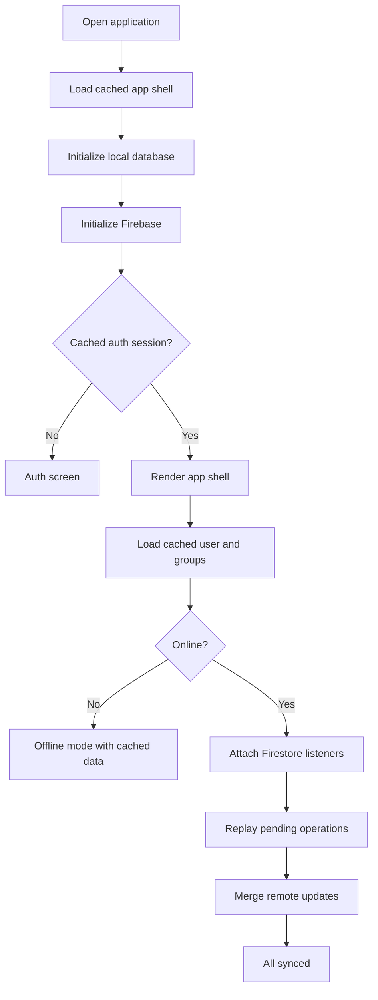
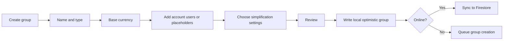
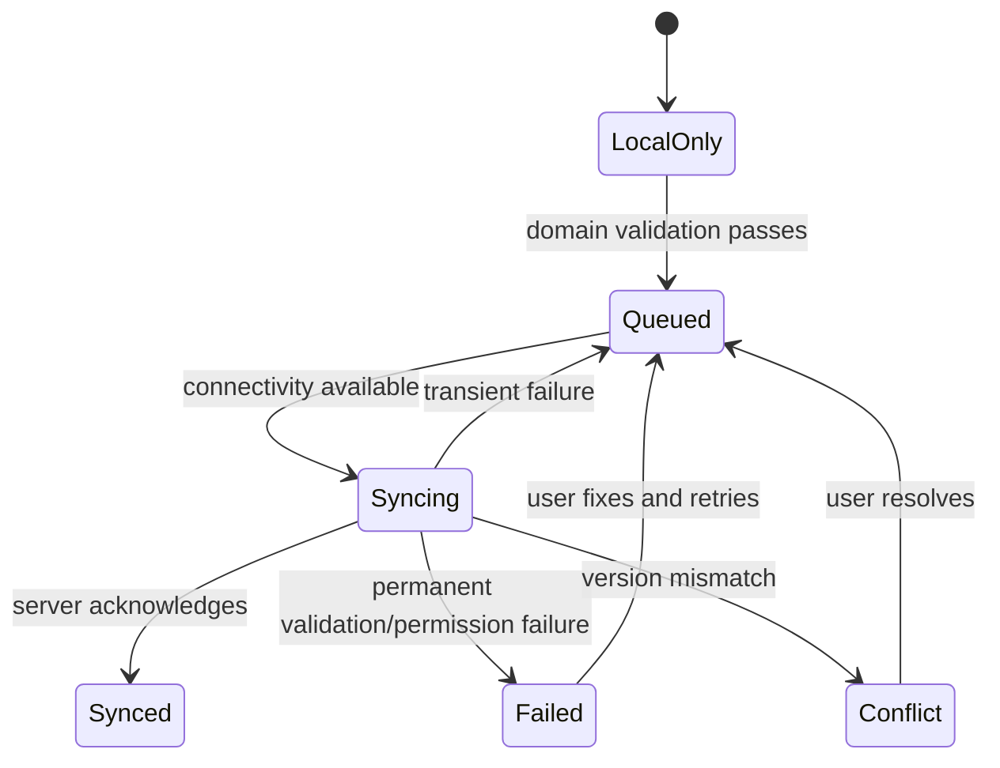

# FairTab — Application Flow

## 1. Navigation model

### Desktop
Persistent left sidebar:
- Overview
- Groups
- Expenses
- Settlements
- Analytics
- Recurring
- Notifications
- Settings

Header:
- current context/group selector;
- global search/command palette;
- sync state;
- notifications;
- user menu.

### Mobile
Bottom navigation:
- Home
- Groups
- Add
- Activity
- Profile

Contextual actions use bottom sheets. The add-expense button remains the dominant primary action.

---

## 2. Bootstrap flow

Bootstrap priorities:
1. Show stable shell.
2. Restore auth state.
3. Render cached content.
4. Connect remote listeners.
5. synchronize pending operations.
6. update derived balances.

Never hold the entire application behind a network spinner after the shell is cached.

---

## 3. Authentication flow

### Registration
1. User opens Register.
2. Enters display name, email, password, confirmation.
3. Client validates with Zod.
4. Firebase account created.
5. User profile document created.
6. Verification email sent.
7. User chooses trusted-device offline storage.
8. User enters onboarding.

### Login
1. Email/password or Google sign-in.
2. Auth state resolves.
3. Device ID is registered locally.
4. Local cache ownership is verified against UID.
5. Dashboard loads from cache.
6. Remote sync starts.

### Sign-out
1. Warn if pending operations exist.
2. Permit:
   - sync then sign out;
   - sign out while retaining encrypted/local pending data;
   - discard pending changes.
3. Detach listeners.
4. Clear sensitive in-memory state.
5. Optionally clear persistent local cache.
6. Return to login.

---

## 4. Onboarding flow

1. Welcome and product value.
2. Create first group or accept invitation.
3. Choose group type and base currency.
4. Add members or invite them.
5. Optional sample expense tutorial.
6. Explain online/offline sync indicators.
7. Arrive at group dashboard.

Onboarding is dismissible and never blocks experienced users.

---

## 5. Group creation flow

Rules:
- creator becomes owner;
- group ID is generated client-side;
- placeholder members receive internal member IDs;
- invitations are separate from membership activation;
- offline-created groups remain private until synced.

---

## 6. Add expense flow

### Step 1 — Basics
- group;
- title;
- amount;
- currency;
- date;
- category;
- receipt.

### Step 2 — Payers
- one payer or multiple payers;
- allocated payment values must equal total.

### Step 3 — Participants
- include/exclude members;
- select split method.

### Step 4 — Split editor
- equal;
- exact;
- percentage;
- shares;
- weighted;
- itemised.

Show remaining/unallocated amount continuously.

### Step 5 — Review
Display:
- total;
- payers;
- participant shares;
- resulting debt changes;
- offline status;
- receipt upload status.

### Step 6 — Save
1. Validate domain invariants.
2. Create expense and split data locally.
3. Apply optimistic UI update.
4. Recalculate balances.
5. Queue or submit write batch.
6. Show “Saved locally” then “Synced” state.
7. On failure, retain operation and show retry.

---

## 7. Edit expense flow

1. Open expense detail.
2. Check permissions.
3. Store base version and hash.
4. User edits fields.
5. Validate.
6. Compare remote/current version if online.
7. If unchanged, save.
8. If version differs, open conflict review.
9. Create audit event.
10. Recalculate balances.

For financial integrity, never silently overwrite a known newer remote version.

---

## 8. Delete and undo flow

1. User selects Delete.
2. Confirmation explains impact.
3. Soft-delete locally.
4. Remove from active derived balances.
5. Show undo toast for configured interval.
6. Queue sync.
7. Audit event records actor and time.
8. Final purge, if supported, follows retention policy.

---

## 9. Settlement flow

1. Open Suggested Settlements or Record Payment.
2. Select payer and recipient.
3. Enter amount/currency/method/date/reference.
4. Show outstanding balance before and after.
5. Validate direction and maximum warning.
6. Save local settlement event.
7. Recompute balances.
8. Sync.
9. If group reaches zero balances, show restrained completion state.

---

## 10. Debt simplification flow

1. Choose a group and currency.
2. Derive each member’s net balance.
3. Validate sum of net balances is zero within precision.
4. Select strategy:
   - minimum transactions;
   - preserve direct debts;
   - exclude counterparties;
   - subgroup-first.
5. Generate plan.
6. Display explanation:
   - before;
   - after;
   - number of transfers removed;
   - assumptions.
7. User records payments individually; plan itself does not mutate ledger.

---

## 11. Receipt/itemisation flow

### Online
1. Select/capture image.
2. Compress client-side.
3. Upload to Storage after security validation.
4. Run optional browser OCR.
5. User corrects merchant/items.
6. Assign each item to members.
7. Allocate tax/tip/discount.
8. Verify totals.
9. Save expense.

### Offline
1. Capture and compress.
2. Store Blob in IndexedDB/OPFS.
3. Create local attachment reference.
4. Save expense with `attachmentStatus=pending`.
5. Upload after reconnection.
6. Replace local URL with cloud metadata.
7. Clear local Blob after verified upload, subject to cache policy.

---

## 12. Recurring expense flow

1. Define template and cadence.
2. On app open/foreground/sync, calculate due occurrences.
3. Use deterministic occurrence ID to prevent duplicates.
4. Depending on mode:
   - auto-create local occurrence; or
   - show review queue.
5. Sync created occurrences.
6. Update `lastGeneratedThrough`.

---

## 13. Invitation flow

1. Admin enters email or selects contact.
2. Invitation document created.
3. User receives shareable link or notification.
4. Invitee authenticates.
5. App validates invitation status, email/UID constraints, and expiry.
6. Membership is created through a controlled transaction or trusted backend path.
7. Invitation marked accepted.
8. Group becomes visible.

Do not permit clients to self-create privileged membership without rules-enforced invitation validation.

---

## 14. Offline synchronization flow

Sync triggers:
- application start;
- `online` browser event;
- app foreground/visibility change;
- active Firestore connection;
- manual retry;
- supported background sync.

Retry:
- exponential backoff with jitter;
- maximum retry threshold before user action;
- never duplicate writes: use deterministic IDs/idempotency keys.

---

## 15. Conflict resolution flow

Conflict screen shows:
- local version;
- cloud version;
- field-level differences;
- actor/time if known;
- balance impact.

Actions:
- keep cloud;
- use local as new edit;
- merge supported fields;
- cancel and export local draft.

Every resolution creates an audit event.

---

## 16. Search flow

1. User enters query.
2. Search cached index immediately.
3. Apply structured filters.
4. Show cached/local results.
5. If online and needed, fetch additional paginated records.
6. Merge/deduplicate.
7. Preserve filter state in URL or local state.

---

## 17. Error flows

### Permission denied
- stop retries;
- explain access may have changed;
- refresh membership;
- offer return to dashboard.

### Network error
- keep local work;
- mark queued;
- do not show destructive error.

### Validation error
- keep form state;
- focus first invalid field;
- explain exact mismatch.

### Unsupported offline action
- save draft where safe;
- state that connection is required;
- avoid dead-end spinner.

### Corrupt local cache
- isolate affected records;
- retain export/diagnostic option;
- rebuild cache from cloud when online.

---

## 18. PWA update flow

1. New service worker detected.
2. Show non-blocking “Update available.”
3. Warn if unsaved form/pending critical state.
4. User selects Update.
5. Persist draft.
6. activate new worker and reload.
7. restore draft and state.
