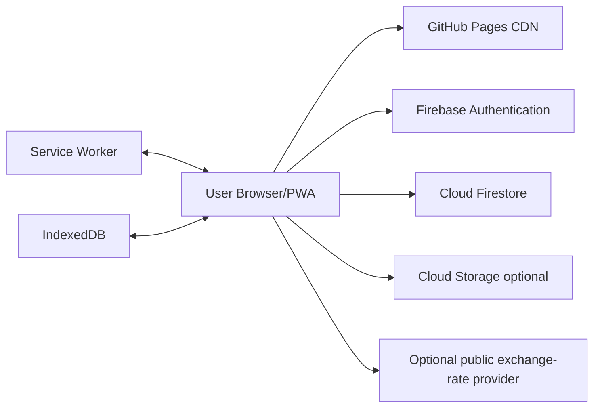

# FairTab — Software Design Document (SDD)

## 1. Purpose

This document defines the application architecture, module boundaries, runtime behavior, data flow, offline model, security design, and implementation conventions for FairTab.

---

## 2. System context



GitHub Pages serves static production assets. Firebase handles authentication and synchronized data. IndexedDB and the service worker provide local-first behavior.

---

## 3. Technology baseline

- React
- TypeScript
- Vite
- Tailwind CSS
- Radix UI or shadcn/ui primitives
- Lucide icons
- Framer Motion, used selectively
- React Hook Form
- Zod
- TanStack Query for server-state coordination where appropriate
- Zustand or Redux Toolkit for focused client state
- Firebase modular Web SDK
- Dexie for custom IndexedDB tables
- vite-plugin-pwa with Workbox
- Recharts
- Vitest and React Testing Library
- Playwright
- Firebase Emulator Suite
- ESLint and Prettier

Do not introduce a dependency unless it solves a clear requirement.

---

## 4. Architectural style

Use feature-oriented modular architecture:

```text
src/
  app/
  components/
  features/
  services/
  domain/
  infrastructure/
  hooks/
  routes/
  styles/
  test/
```

Dependency direction:

```text
UI -> Application services -> Domain -> Infrastructure adapters
```

Domain algorithms must not import React or Firebase.

---

## 5. Proposed repository structure

```text
FairTab/
├── .github/
│   └── workflows/
│       ├── ci.yml
│       └── deploy-pages.yml
├── docs/
│   ├── PRD.md
│   ├── SDD.md
│   └── ...
├── public/
│   ├── icons/
│   ├── offline.html
│   └── robots.txt
├── src/
│   ├── app/
│   │   ├── App.tsx
│   │   ├── providers/
│   │   ├── router/
│   │   └── bootstrap/
│   ├── components/
│   │   ├── ui/
│   │   ├── feedback/
│   │   └── layout/
│   ├── domain/
│   │   ├── money/
│   │   ├── expenses/
│   │   ├── balances/
│   │   ├── settlements/
│   │   └── recurring/
│   ├── features/
│   │   ├── auth/
│   │   ├── dashboard/
│   │   ├── groups/
│   │   ├── expenses/
│   │   ├── settlements/
│   │   ├── analytics/
│   │   ├── receipts/
│   │   ├── search/
│   │   ├── recurring/
│   │   └── settings/
│   ├── infrastructure/
│   │   ├── firebase/
│   │   ├── indexeddb/
│   │   ├── pwa/
│   │   └── logging/
│   ├── services/
│   │   ├── sync/
│   │   ├── export/
│   │   └── currency/
│   ├── hooks/
│   ├── styles/
│   ├── types/
│   ├── test/
│   ├── main.tsx
│   └── sw.ts
├── firebase.json
├── firestore.indexes.json
├── firestore.rules
├── storage.rules
├── vite.config.ts
├── package.json
└── README.md
```

---

## 6. Core domain modules

### 6.1 Money

Responsibilities:
- minor-unit representation;
- currency metadata;
- safe addition/subtraction;
- formatting;
- deterministic rounding;
- conversion display.

No `number` floating calculations for money division without controlled rounding.

### 6.2 Expense allocation

Pure functions:
- validate payer allocations;
- equal split;
- exact split;
- percentage split using basis points;
- shares split;
- weighted split;
- itemised allocation;
- assign rounding remainder.

### 6.3 Balance engine

Input:
- active expenses;
- active settlements;
- member list;
- currency.

Output:
- per-member paid;
- per-member share;
- settlement inflow/outflow;
- net;
- trace entries.

Property:
- sum of all member net balances equals zero for each currency.

### 6.4 Settlement optimiser

Greedy baseline:
1. partition creditors and debtors;
2. sort by absolute balance;
3. match largest debtor and creditor;
4. transfer minimum of their outstanding amounts;
5. repeat.

This often produces a small plan but does not guarantee the theoretical minimum transaction count for all constrained variants. The UI must call it “simplified” unless a proven exact optimiser is implemented.

Advanced modes can use graph constraints or optimisation later.

### 6.5 Recurrence engine

Pure deterministic generation:
- given template and date range;
- output due occurrence dates;
- stable occurrence keys;
- timezone-aware date handling;
- no duplicate generation.

---

## 7. Application state

Separate state categories:

### Remote synchronized state
- Firestore query results;
- group membership;
- expenses;
- settlements.

### Local durable state
- outbox;
- pending attachment Blobs;
- drafts;
- trusted-device preference;
- local search index.

### Ephemeral UI state
- open modal;
- current wizard step;
- filter drawer;
- toast queue;
- animation state.

Do not place all state in one global store.

---

## 8. Data access design

Repository interfaces:

```ts
interface ExpenseRepository {
  watchByGroup(groupId: string, options: ExpenseQuery): Unsubscribe;
  getById(groupId: string, expenseId: string): Promise<Expense>;
  save(expense: Expense, context: MutationContext): Promise<MutationResult>;
  softDelete(groupId: string, expenseId: string, context: MutationContext): Promise<void>;
}
```

Implementations:
- `FirestoreExpenseRepository`;
- `OfflineAwareExpenseRepository`;
- test in-memory repository.

The offline-aware layer coordinates optimistic state and the outbox.

---

## 9. Offline-first design

### 9.1 Read strategy

1. render cached route shell;
2. read local/Firestore persistent cache;
3. subscribe to remote updates;
4. merge remote records by ID/version;
5. recompute derived values.

### 9.2 Write strategy

1. validate domain object;
2. assign deterministic entity ID and mutation ID;
3. persist pending operation before declaring success;
4. update local materialized view;
5. attempt Firestore batch;
6. on acknowledgement, mark synced;
7. on recoverable failure, retry;
8. on permission/validation failure, mark failed;
9. on version conflict, require resolution.

### 9.3 Idempotency

Every mutation includes:
- `clientMutationId`;
- deterministic entity ID;
- source device ID.

Repeated replay must not create duplicates.

### 9.4 Conflict model

Records include `version`.

Update precondition:
- local base version should match known server version.

Because browser clients cannot rely on arbitrary server-side compare-and-swap while offline, use:
- transactions for online edits;
- conflict detection on reconnect;
- immutable event/reversal patterns for sensitive records;
- last-write-wins only for low-risk preferences.

### 9.5 Background sync

Use service-worker background sync as an enhancement, not the sole mechanism. The app synchronizes on:
- start;
- reconnect;
- foreground;
- manual action.

---

## 10. PWA caching design

Recommended custom service worker (`injectManifest`).

Precache:
- hashed JS/CSS assets;
- app icons;
- offline fallback;
- critical fonts if licence permits.

Runtime caching:
- same-origin images: CacheFirst with limits;
- non-sensitive static assets: StaleWhileRevalidate;
- navigation: NetworkFirst with cached shell fallback;
- do not cache authenticated Firestore REST responses manually;
- do not cache sensitive export files.

Update strategy:
- prompt user when a new worker is waiting;
- never auto-reload during an unsaved form;
- persist drafts before reload.

---

## 11. Firebase design

### Authentication
Providers:
- Email/password;
- Google.

Use modular SDK. Restrict authorized domains to intended environments.

### Firestore
- persistence enabled only after trusted-device consent where required;
- realtime listeners scoped to visible/active groups;
- pagination for historical data;
- batched writes for related records;
- Emulator Suite in development/tests.

### Storage
Path convention:
```text
receipts/{groupId}/{expenseId}/{attachmentId}.{ext}
avatars/{uid}/{imageId}.{ext}
groups/{groupId}/{imageId}.{ext}
```

Validate:
- authenticated;
- membership;
- owner path;
- content type;
- max size.

---

## 12. UI architecture

### Design tokens
Use CSS variables:
- surfaces;
- text hierarchy;
- semantic states;
- glass blur/opacity;
- radii;
- spacing;
- shadows;
- motion durations.

### Component layers
1. Primitive UI
2. Composite domain components
3. Feature screens
4. Route layouts

### Feedback components
- `Skeleton`;
- `InlineSpinner`;
- `RoutePending`;
- `EmptyState`;
- `ErrorState`;
- `OfflineBanner`;
- `SyncStatus`;
- `ConflictBadge`;
- `Toast`.

Every async feature must define loading, loaded, empty, error, offline, permission denied, and partial-data behavior.

---

## 13. Routing

For GitHub Pages, use one of:

### Preferred
`HashRouter`, producing routes such as:
`/#/groups/{groupId}`

Advantages:
- no 404 rewrite required;
- robust for project pages.

### Alternative
BrowserRouter plus a 404 SPA redirect workaround.

The first production implementation should use HashRouter unless a custom domain/hosting setup justifies BrowserRouter.

---

## 14. Security design

- deny-by-default rules;
- membership and role helpers;
- prohibit arbitrary field additions;
- validate bounded field lengths;
- prevent role escalation;
- prevent cross-group references;
- restrict notification ownership;
- Storage type/size checks;
- sanitize all displayed/imported strings;
- avoid `dangerouslySetInnerHTML`;
- no secrets in `.env` exposed to Vite;
- treat `VITE_*` variables as public configuration;
- dependency scanning in CI.

Firebase config values may be public; permissions must not depend on hiding them.

---

## 15. Error handling

Normalized error type:

```ts
interface AppError {
  code: string;
  category: "validation" | "auth" | "permission" | "network" | "conflict" | "storage" | "unknown";
  userMessage: string;
  retryable: boolean;
  cause?: unknown;
}
```

Never show raw Firebase stack traces to users.

Error boundaries:
- root;
- route;
- high-risk feature such as receipt editor.

---

## 16. Observability

Initial:
- structured console logger disabled/reduced in production;
- optional privacy-conscious error service;
- sync diagnostics view;
- correlation/mutation IDs;
- no receipt text or financial descriptions in telemetry by default.

Metrics:
- sync duration;
- pending queue size;
- failed mutation count;
- route load;
- OCR failure rate.

---

## 17. Testing strategy

### Unit
- money;
- split algorithms;
- balance invariants;
- settlement optimiser;
- recurrence;
- validation schemas.

### Property-based
- sum of shares equals total;
- net balances sum to zero;
- settlement plan preserves net positions;
- no negative allocation;
- deterministic rounding.

### Integration
- repositories with Emulator;
- auth flows;
- Firestore rule decisions;
- offline queue replay;
- conflict detection.

### E2E
- create account;
- create group;
- add expense;
- offline add and reconnect;
- edit conflict;
- settle;
- export;
- installability smoke test.

---

## 18. Build and deployment

`vite.config.ts` must use:
```ts
base: "/<repository-name>/"
```
for GitHub project pages, or an environment-derived base.

GitHub Actions:
1. checkout;
2. setup Node;
3. install locked dependencies;
4. lint;
5. type-check;
6. test;
7. build;
8. upload Pages artifact;
9. deploy.

Production Firebase configuration is supplied through GitHub repository variables/secrets, while recognizing browser Firebase config is not a secret. Never store Admin SDK credentials.

---

## 19. Architectural decisions

### ADR-001: GitHub Pages + Firebase
Accepted for free static hosting and managed collaboration services.

### ADR-002: HashRouter
Accepted for reliable project-page routing.

### ADR-003: Minor units for money
Accepted to avoid floating-point errors.

### ADR-004: Ledger-derived balances
Accepted to preserve explainability and prevent drift.

### ADR-005: Custom IndexedDB outbox
Accepted to improve visibility, idempotency, retries, and attachment handling beyond implicit Firestore caching.

### ADR-006: Controlled glassmorphism
Accepted with performance fallback.

### ADR-007: No guaranteed scheduled recurrence in static-only architecture
Accepted; generation occurs on client lifecycle until optional backend scheduling is introduced.
